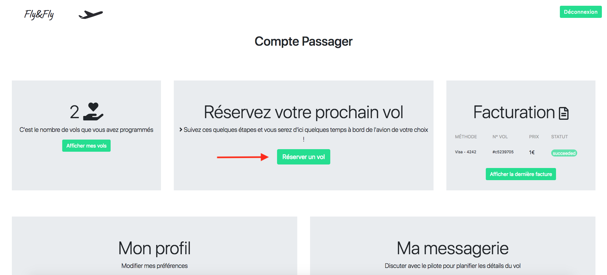
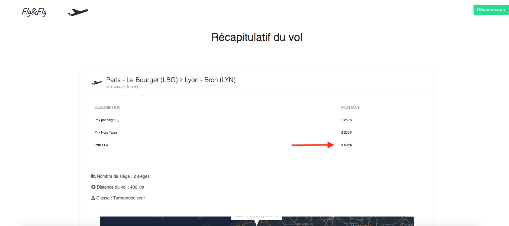
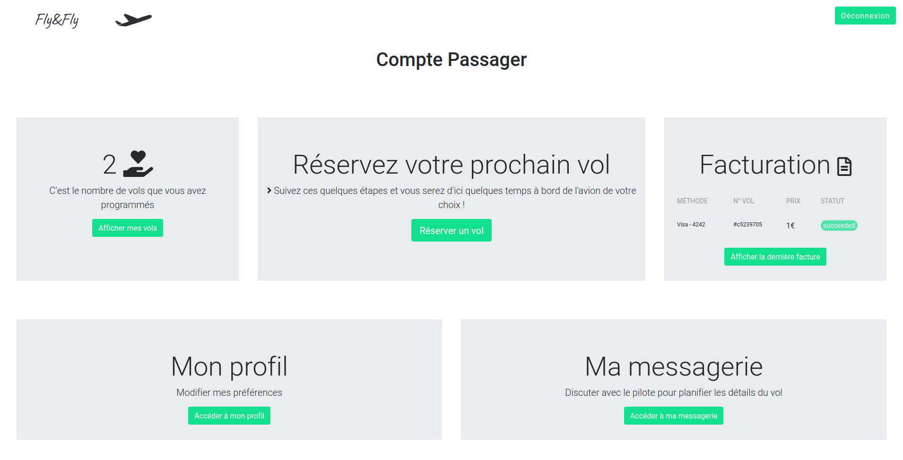

# __Foire aux questions Passagers__

---

## Réserver un vol

 Pour réserver un vol avec FlyandFly vous devez être préalablement connecté à votre compte passager. Si vous n'en avez pas vous pouvez en [créer un ici](https://flyandfly.fr/register.php?status=client).

 Une fois connecté à votre compte passager, cliquez sur **`Réserver un vol`**.
 

### Choisir l'aéroport de départ

 Choisissez ensuite l'aéroport de départ de votre vol, et l'horaire du vol.

 > **Conseil** : Pensez à réserver votre vol quelques temps à l'avance le temps de trouver un pilote. Les vols sont automatiquement annulé un jour à l'avance.  

 Cliquez ensuite sur **`Choisir l'aéroport d'arrivé`** pour procéder à la suite de la réservation.

### Choisir l'aéroport d'arrivé

Choisissez l'aéroport d'arrivé de votre choix.

Procédez ensuite au choix de la classe de l'avion et au nombre de passagers pour ce vol.

?> **Aide** : Le coplanage permet de partager les frais du vol avec d'autres passagers qui souhaitent effectuer le même vol.

Cliquez sur **`Soumettre le vol`** pour afficher le récapitulatif du vol.

### Récapitulatif du vol

Vous arrivez sur la page de récapitulatif du vol.

Le prix par siège ainsi que le prix TTC s'affiche. Ces derniers sont calculés grâce à la distance du vol, la classe et le nombre de passagers.

Pour confirmer le vol vous devrez procéder à l'autorisation du paiement.
Pour ce faire cliquez sur **`Proposer le vol`** pour poursuivre la réservation.

### Autorisation de prélevement

Saisissez vous informations bancaire afin de valider les futures transactions de votre compte.

> **Pensez à lire les conditions générales d'utilisations.**

Cliquez ensuite sur **`Autoriser le paiement`**.

?> **Vous pourrez en apprendre plus sur la procédure de paiement sur [la page dédié aux paiement](#).**

Félicitation votre vol vient d'être réservé !

---

## Rejoindre un vol existant

Pour rejoindre un vol existant vous devrez vous rendre sur la [liste des vols disponibles](https://flyandfly.fr/flights_list.php).

Tapez votre recherche dans la barre prévu à cet effet (aéroport de départ, aéroport d'arrivé, numéro de vol...)
Le moteur de recherche intégré va s'occuper de trouver le vol correspondant le mieux à vos critères.
Cliquez ensuite sur le bouton **`Afficher les détails`**" du vol vous correspondant.

Une page récapitulatif du vol s'affiche, vérifier bien que les informations vous correspondent.

Cliquez ensuite sur le bouton **`Rejoindre le vol`** si vous êtes pleinement satisfait de ces critères sinon vous pouvez toujours réserver votre [propre vol](?id=réserver-un-vol)

---

## Paiement

Lors de la réservation de votre vol, vous serez amené à saisir vos informations bancaires afin de finaliser la réservation.

> **Tant que le vol n'a pas été accepté par un pilote, vous ne serez pas prélevé du prix affiché lors de la réservation.**

Aucune information bancaire n'est stocké sur nos serveurs. Notre partenaire de paiement Stripe se charge de conserver vos informations de façon crypté dans leur base de données. Lors de procédure de paiement, nous envoyons vos informations grâce au protocole https fournit par le certificat HLS de dernière génération à Stripe qui se charge de nous envoyer en retour un identifiant client unique nous permettant de vous débiter le montant voulu une vois le vol terminé dans de bonnes conditions.

!> **Il se peut que vous observiez des micro paiement sur votre compte bancaire (souvent moins d'un euro). Ceci nous permet de vérifier que les fonds nécessaires à payer le vol soient disponibles sur votre compte bancaire.**

---

## Parler au Pilote

Une fois vol votre réservé, vous pouvez être amené à vouloir poser des questions au(x) pilote(s) en charge de votre vol.
Pour ce faire rendez vous sur votre [Panel Passager](https://flyandfly.fr/client/) et cliquez sur **`Afficher mes vols`**
 

---

# __Foire aux questions Pilote__

---

---

# __Foire aux questions Propriétaire__

---

# Informations utiles

[Retour à l'accueil](https://flyandfly.fr/) ❘ [Nous contacter](https://flyandfly.fr/contact) ❘ [Informations légales](https://flyandfly.fr/conditions-generales)
